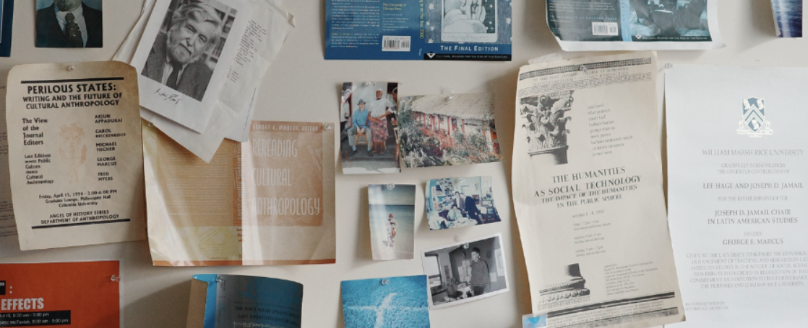

#### Description

The George E. Marcus Archive is a digital archive project focused on documenting the intellectual and institutional contributions of anthropologist George E. Marcus. The archive revolves Marcus’s career-long efforts to remake ethnographic research for contemporary conditions, including experiments in collaborative anthropology, multi-sited ethnography, and new forms of ethnographic knowledge production.

The archive includes a wide range of materials spanning Marcus’s academic career, including field notes, correspondence, collaborative research projects, course syllabi, and institutional initiatives he has helped build. In addition to historical documentation, the archive features contemporary reflections on Marcus’s work by colleagues, collaborators, students, and Marcus himself.

The project is part of a broader initiative to build the Critical Cultural Theory Archive, a digital infrastructure designed to preserve and recontextualize the intellectual histories of scholars working at the intersection of anthropology, cultural theory, and science and technology studies.

---

#### View

+ [Archive portal](https://www.centerforethnography.org/curate/pece-essay/george-e-marcus-archive)

---

#### Citation

Schütz, Tim, Mike Fortun, and Kim Fortun. 2025. *The George E. Marcus Archive.* *UCI Center for Ethnography*. https://www.centerforethnography.org/curate/pece-essay/george-e-marcus-archive 
